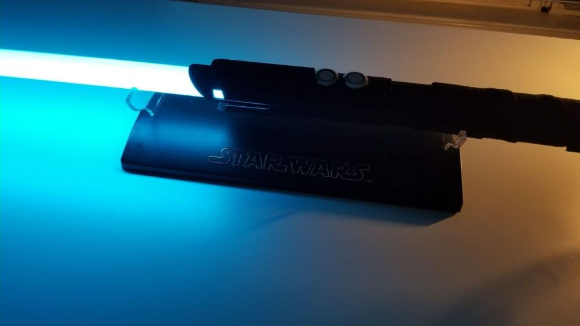

# Arduino-Lightsaber
The Arduino Lightsaber is a model lightsaber created with a 3D printed hilt and ws2812b LED strips 

## Description
This project was my first adventure into working with electronics and hardware. Since I was transitioning from an Aerospace Engineering major, I knew next to nothin about working with hardware let alone software development. From October 2019 to May 2020 I gradually started picking up the knloweldge I needed to eventually finish the project. 

My goal was to create a somewhat realistic model lightsaber similar to the ones produced by companies such as ultrasabers and kyberlight although definetly not as durable. To make up for that, I wanted the ability to control the color of the blade and allow the user to choose the sound fonts. 

The biggest challenge was mounting everything inside the hilt. When I designed it, I did not account for the extra bit of width on the breadboards and the space taken up by the lipo battery. As a result I decided to remove the IMU since I wasn't able to spend too much longer on this project. Fortunately, I was able to include the color chaning blade and changeable sound fonts. 

For the most part this was a sucess even on a small scale. Starting from absolutely nothing, I did learn alot and some of that knowledge served me in my classes. Despite the mistakes, I think this was a good first step and there will definetly be a second model at some point in the future. 

## Final Product

## Components used
- [Arduino Nano Every]
- [MPU-9250]
- [2x WS2812B]
- [Mini Solderable Breadboard]
- [2w 28mm Speaker]
- [Adafruit Audio FX Sound Board]
- [19mm Latching Push button Switch]
- [19mm Momentary Push Button Switch]

## Blade components
- [Clear 1" thin walled blade tip]
- [V2 Foam tube]
- [Thin Walled Pixel Blade Adapter]
- [Trans White Polycarbonate tube]

-All parts should be easily obtainable using the links included

[Arduino Nano Every]: https://store.arduino.cc/usa/nano-every
[MPU-9250]: https://www.amazon.com/gp/product/B01I1J0Z7Y/ref=ppx_yo_dt_b_asin_title_o01_s00?ie=UTF8&psc=1
[2x WS2812B]: https://www.amazon.com/gp/product/B01CDTE6Y6/ref=ppx_yo_dt_b_asin_title_o06_s01?ie=UTF8&psc=1
[Mini Solderable Breadboard]: https://www.amazon.com/Gikfun-Solder-able-Breadboard-Arduino-Electronic/dp/B0778G64QZ/ref=sr_1_4?crid=3AZ6AJPPDNHPT&dchild=1&keywords=mini+solderable+breadboard&qid=1605936831&sprefix=mini+soderable+breadb%2Caps%2C172&sr=8-4
[2w 28mm Speaker]: https://www.thecustomsabershop.com/2W-28mm-Bass-Speaker-P662.aspx
[Adafruit Audio FX Sound Board]: https://www.adafruit.com/product/2210
[19mm Latching Push button Switch]: https://www.amazon.com/gp/product/B07XKNM386/ref=ppx_yo_dt_b_asin_title_o00_s00?ie=UTF8&psc=**1**
[19mm Momentary Push Button Switch]: https://www.amazon.com/gp/product/B07XN78WXH/ref=ppx_yo_dt_b_asin_title_o00_s01?ie=UTF8&psc=1
[Clear 1" thin walled blade tip]: https://www.thecustomsabershop.com/Clear-1-thin-walled-blade-tip-P138.aspx
[V2 Foam tube]: https://www.thecustomsabershop.com/Foam-tube-for-1-thin-tubes-V2-P1336.aspx
[Thin Walled Pixel Blade Adapter]: https://www.thecustomsabershop.com/1-Thin-Walled-Pixel-Blade-Adapter-P1346.aspx
[Trans White Polycarbonate tube]: https://www.thecustomsabershop.com/1-Thin-walled-Trans-White-PolyC-40-long-P529.aspx

## Required Libraries
- [Bolder Flight Systems MPU9250]
- [Adafruit NeoPixel Library]

[Bolder Flight Systems MPU9250]: https://github.com/bolderflight/MPU9250
[Adafruit NeoPixel Library]: https://github.com/adafruit/Adafruit_NeoPixel

## Project Status
All development on this project has stopped currently. 

## Future Roadmap
There are plans to make a second model sometime during 2021 or later. I want to fix the mistakes I made with this model and create a much more robust product. 
    
